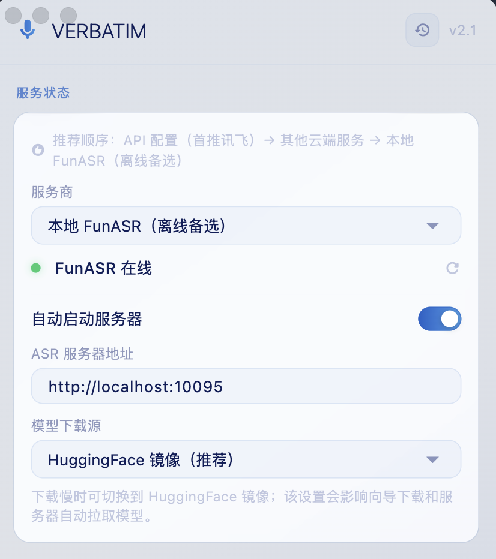
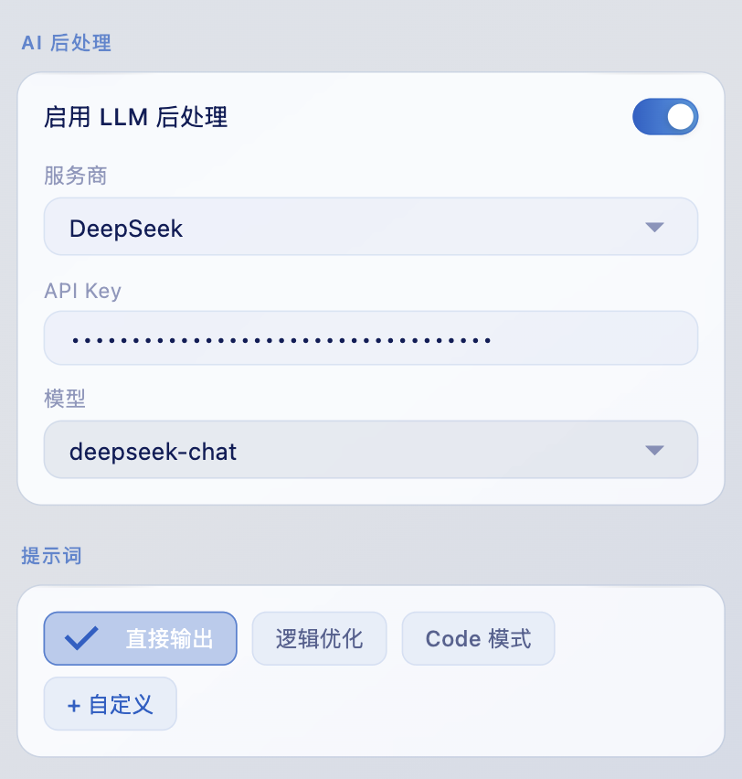
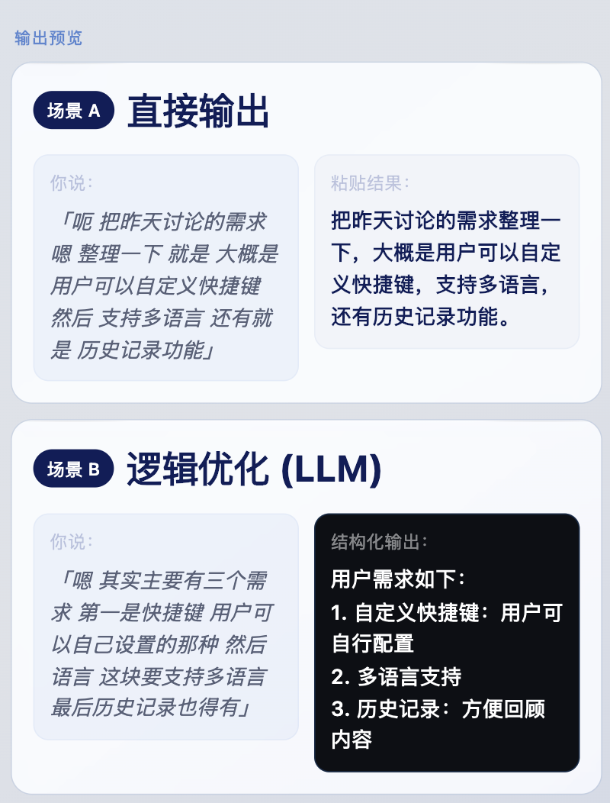

# VERBATIM

> 说话，文字直接出现在光标处。无需切换窗口，无需动手。

[](https://github.com/Tengxiaoteng/VERBATIM/releases/latest/download/VERBATIM-v1.0.1-macos.zip)


---

## 为什么用 VERBATIM？

**打字太慢** — 说话比打字快 3 倍。长段文字、会议记录、备忘录，直接说出来，实时转文字。

**手不离键盘** — 在任何应用里按住 `Fn`（可自定义），松开后文字已经粘贴好，不用切窗口、不用点击任何按钮。

**中文识别准** — 支持讯飞、SiliconFlow 等专为中文优化的服务，标点自动加，说完即可用。

---

## 效果示例

**场景 A：直接输出** — 说话时自然带出的填充词、停顿都被过滤，标点自动补全

```
你说：「呃 把昨天讨论的需求 嗯 整理一下 就是 大概是 用户可以自定义快捷键
        然后 支持多语言 还有就是 历史记录功能」

→ 粘贴到光标处：
把昨天讨论的需求整理一下，大概是用户可以自定义快捷键，支持多语言，还有历史记录功能。
```

**场景 B：逻辑优化** — 同一段口语，开启 LLM 后处理后自动结构化

```
你说：「嗯 其实主要有三个需求 第一是快捷键 用户可以自己设置的那种 然后语言
        这块要支持多语言 最后历史记录也得有 这样可以回看之前说过的」

→ 逻辑优化后：
用户需求如下：
1. 自定义快捷键：用户可自行配置
2. 多语言支持
3. 历史记录：方便回顾过往内容
```

**场景 C：Code 模式** — 口述开发需求，自动提取为可执行任务清单

```
你说：「嗯 这个功能要做三件事 首先把登录接口接上 然后 用户名密码要加校验
        对了 还要加个记住密码的选项」

→ Code 模式输出：
- [ ] 接入登录接口
- [ ] 添加用户名/密码校验
- [ ] 实现"记住密码"功能
```

---

## 对比其他方案

|  | VERBATIM | macOS 自带听写 | 专用转写 App |
|---|---|---|---|
| 在任意 App 的光标处直接粘贴 | ✅ | ✅ | ❌ 需切换 App |
| 离线可用（本地 FunASR） | ✅ | ✅ | ❌ 依赖网络 |
| LLM 后处理（整理/代码） | ✅ | ❌ | 部分支持 |
| 中文专项优化（讯飞/SiliconFlow） | ✅ | 一般 | 视服务而定 |
| 自定义提示词 | ✅ | ❌ | ❌ |
| 历史记录 | ✅ | ❌ | ✅ |
| 开源免费 | ✅ | ✅ | ❌ |

---

## 截图

<table>
  <tr>
    <td><br/><sub>服务状态与模型下载源</sub></td>
    <td><br/><sub>录音热键与模式切换热键</sub></td>
  </tr>
  <tr>
    <td><br/><sub>AI 后处理与提示词模式</sub></td>
    <td><br/><sub>输出预览：直接输出与逻辑优化</sub></td>
  </tr>
</table>

---

## 快速安装

```
1. brew install sox
2. 下载解压 → VERBATIM.app 拖入应用程序
3. 首次启动按提示授权麦克风 + 辅助功能
4. 按住 Fn 说话，松开自动粘贴（可在设置改成任意热键）
```

---

## 支持的 ASR 服务

推荐顺序：`讯飞 API（首推）` → 其他云端 API → `本地 FunASR（离线备选）`

| 服务 | 凭证格式 | 获取地址 |
|------|----------|----------|
| 讯飞 iFlytek（推荐） | `AppID:APIKey:APISecret` | [console.xfyun.cn](https://console.xfyun.cn) |
| SiliconFlow | `sf-...` | [siliconflow.cn](https://siliconflow.cn) |
| OpenAI Whisper | `sk-...` | [platform.openai.com](https://platform.openai.com) |
| Groq | `gsk_...` | [console.groq.com](https://console.groq.com) |
| 本地 FunASR（离线备选） | 无需 Key | — |
| 自定义 OpenAI 兼容 | 任意 | — |

---

## 常见问题

**Q: 报错"未找到 rec 命令"**
A: 执行 `brew install sox`，然后确认 `which rec` 有输出。

**Q: 录音正常但识别失败（本地 FunASR）**
A: 确认服务已启动：`curl http://localhost:10095/health` 应返回 200。

**Q: 识别成功但未粘贴**
A: 检查辅助功能权限；在系统设置中将 VERBATIM 条目删除后重新添加。

**Q: 讯飞凭证格式**
A: 在 [console.xfyun.cn](https://console.xfyun.cn) 创建应用后，将 AppID、APIKey、APISecret 按 `AppID:APIKey:APISecret` 格式填入。

---

## License

MIT © 2025 Tengxiaoteng
